This project was created to make videos for songs by the band [Grueso Calibre](https://linktr.ee/gruesocalibre), which are uploaded to their official channel. You are free to clone the project and use it as a template to create and publish your own videos, as long as you respect the licensing agreements.

Some videos made using this base project:
| [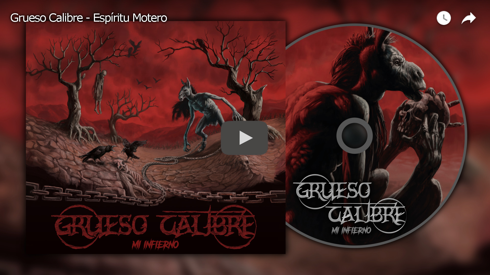](https://www.youtube.com/watch?v=NrPHfa_gdIw) | [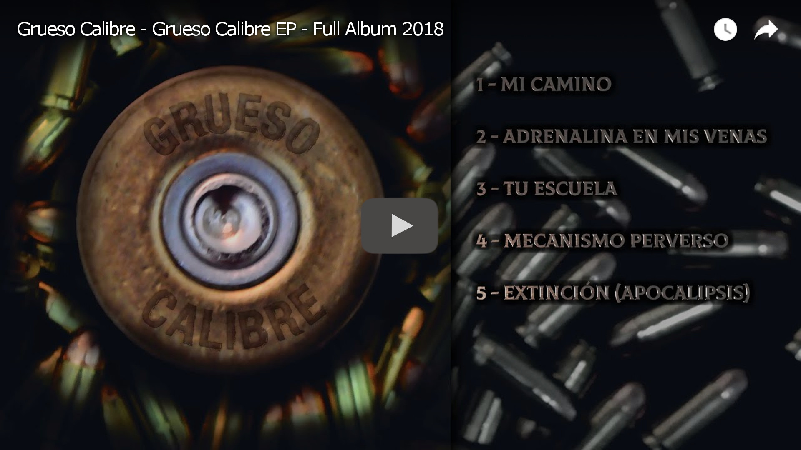](https://www.youtube.com/watch?v=dmHpTKTuH4E) |
|:-:|:-:|

To use this project as a template for making your own videos, you will need: 
* [Unreal Engine](https://www.unrealengine.com/) 5.3 or higher 
* [Blender](https://www.unrealengine.com/) 4.0 or higher 
* [FFmpeg](https://ffmpeg.org/)

Optional: [Audacity](https://www.audacityteam.org/), [Visual Studio Code](https://code.visualstudio.com/), [GIMP](https://www.gimp.org/)

The beauty of this project is that the songs come with subtitles, and it's possible to create a video for either a single song or an entire album. This allows for the concatenation of songs, displaying a song list, adding timelines for each song, as well as the ability to add any elements that Unreal Engine allows to our videos.  
The project uses prerendered 3D texts in Blender, which were generated and post-processed jointly.

## The steps you need to follow

1 - **Organize the verses of your song(s)**: 
The first and also the most tedious of all tasks. This involves noting down the verses to display and the start and end times of each verse. You'll need to play the songs and pause to note the start and end times of each verse.

I used [Google Sheets](https://docs.google.com/spreadsheets) to generate a spreadsheet containing all the verse data for all the songs, and [Audacity](https://www.audacityteam.org/) to record times with better accuracy.  
**IMPORTANT**: Unreal Engine requires times in seconds, so you can't use `1:02:345` as a time format, but rather `45` or `62.345`, as it's a floating-point value. I couldn't find any playback software that displays times in this format.

You can take a look at this spreadsheet I made by [clicking here](https://docs.google.com/spreadsheets/d/1fagAUUwv824Uq0jJbFrBGfzii1rGymVvH6OfE6O9rS0/edit?usp=sharing), and clone it if you need to. This spreadsheet will not only help organize the song data but also convert the format `M,S,D` (Minutes, seconds, decimals), commonly displayed by most playback programs, to `S,D` (Seconds, decimals) and vice versa. Data is entered in the green columns, and results are displayed in the blue columns. Just make sure to respect the commas in the `M,S,D` format.

[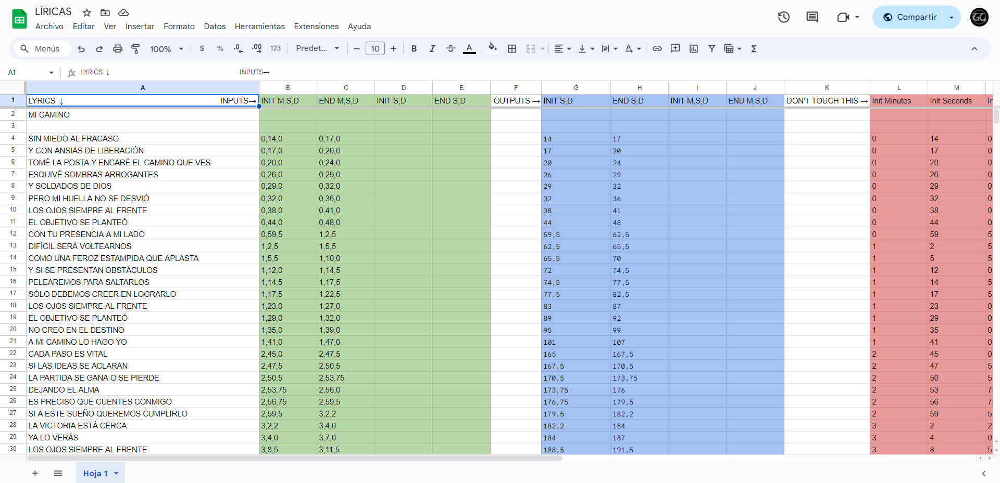](https://docs.google.com/spreadsheets/d/1fagAUUwv824Uq0jJbFrBGfzii1rGymVvH6OfE6O9rS0/edit?usp=sharing)

2 - **Create a visual prototype of your video**: 
I used [GIMP](https://www.gimp.org/) to create a mockup of how my video should look. I exported the layers individually and saved the project (to later re-enter, retrieve the saved positions, and place everything in the same place in Unreal), leaving a space below to include subtitle text. You can use any other program you prefer.

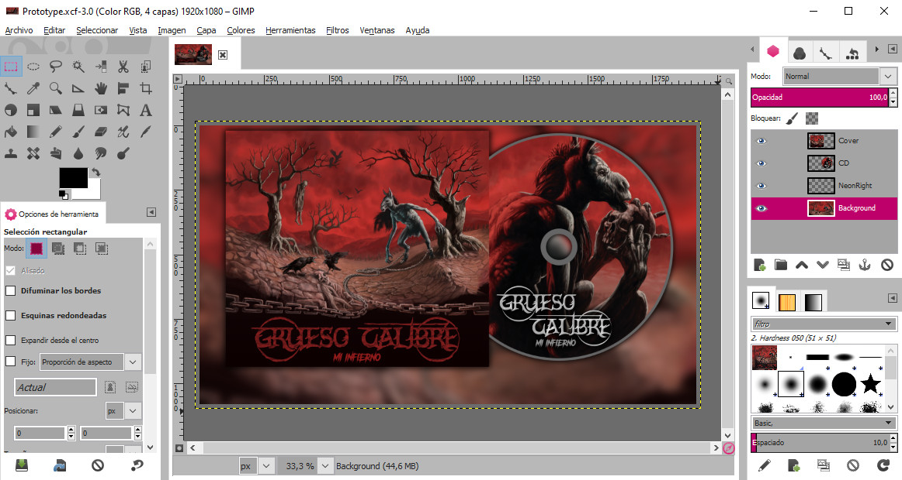
The Prototype.xcf that I used to build the Grueso Calibre video is located in the RawContent folder. All project assets are contained in this folder.

3 - **Generate prerendered subtitles**: 
In the following video tutorial, I explain how to animate text and generate a series of prerendered texts using [Blender](https://www.unrealengine.com/) along with the [Add-on Typewriter Effect](https://github.com/cesarl94/blender-typewriter-addon).
[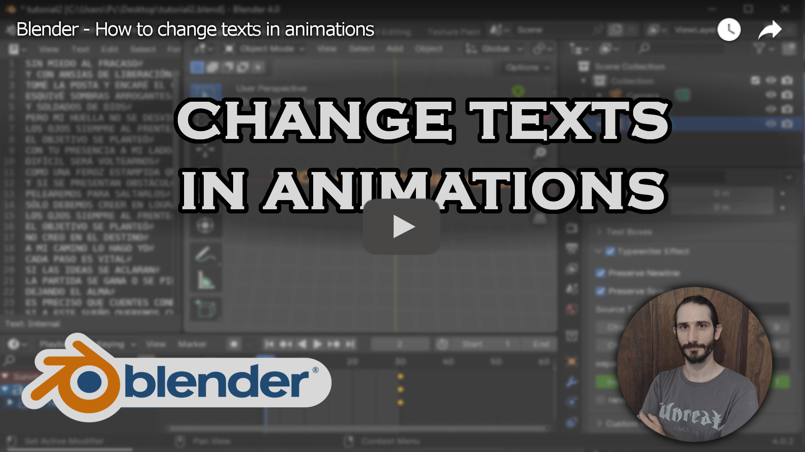](https://www.youtube.com/watch?v=rTG_1kPb8g4)
The Texts.blend file from this project I also in the RawContent folder ↓
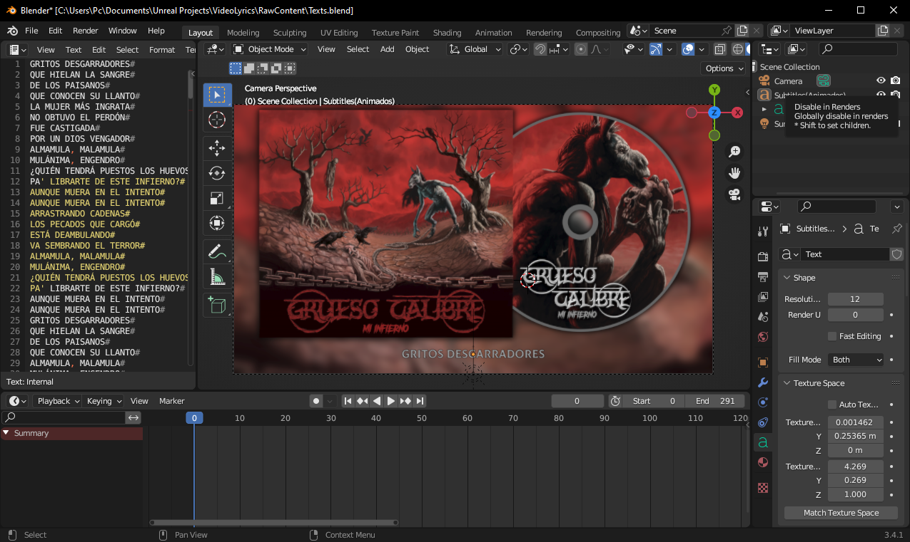
This project file is much more comprehensive than what was shown in the video, but the foundation is the same. It includes scene composition nodes.

4 - **Clone this repository**: 
1) [Create a new repository from GitHub](https://github.com/new), for example `my-project-name`. 
2) Go to the windows console and go to the folder where you have your projects, for example `cd Documents\Projects` 
3) Clone the project with the command `git clone git@github.com:cesarl94/VideoLyrics.git my-project-name` 
4) Now go to the folder of the project with the command `cd my-project-name` 
5) Remove the origin with the command `git remote remove origin` 
6) Copy the SSH URL of the new repository. 
7) Returning to cmd, add the origin of your new repository with the command `git remote add origin <SSH URL of my-project-name>` 
8) Now push the project to the new repository with the command `git push --set-upstream origin master` 

If you use a [Git](https://git-scm.com/) client like [GitHub Desktop](https://desktop.github.com/), [Fork](https://git-fork.com/) or [GitKraken](https://www.gitkraken.com/), after all the steps, you can "add an existing repository" to work with that program from now on. They will probably offer to initialize [GitLFS](https://git-lfs.com/), just say yes.

5 - Open and edit the project in Unreal Engine 5.3
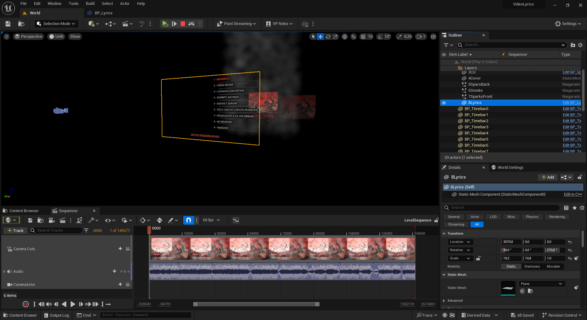

At first glance, we see how the project has each layer scattered in 3D space. This is because we combined elements like simple images (in this case Quads and a texture) with the Niagara particle system from UE5.

To perceive this as a 2D result similar to our mockup, we use an orthographic camera and Unlit materials. 
**IMPORTANT**: In this project, ALL MATERIALS ARE UNLIT, as all the textures used already had the desired color.

Within the "Outliner" tab, we can see the hierarchy of objects within the level.

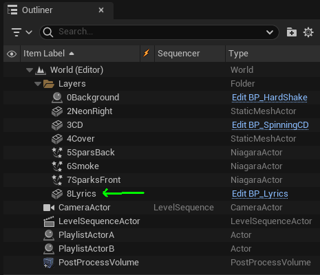

Here you'll find a folder named "Layers," which contains the visible objects in order, some of which are instances of a Blueprint because they have particular behaviors, such as shaking or rotating. At the top, there's an object named "8Lyrics," which is an instance of the Blueprint "BP_Layers." This is one of the key objects in this entire project.

## BP_Layers: 
This object is responsible for:

* Displaying subtitles and determining when they appear and disappear, activating a fade-in and fade-out animation in alpha.
* Performing a fade-in and fade-out to black at the beginning and end of the video.
* Showing a playlist of songs (optional).
* Creating and updating timebars for each song (optional).
* Removing the Tonemapper and ensuring that the colors, both when playing and rendering, are consistent (optional).
Therefore, it's important to keep it closest to the camera among all our layers, as it can be interpreted as the interface of our video.

The video's configuration should be entered from the details panel of the object instance, under the "Lyrics" category. In this case, the object contains information for an album with 9 songs. 
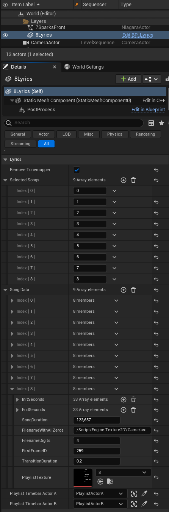

The information entered here will determine whether we create a video for a single song or a playlist. Additionally, it will determine which verses will appear, when they will appear, and other options such as including a playlist and adding timebars for each song.

* SongData: This is an array of structs containing the data of the songs:
    * InitSeconds & EndSeconds: Arrays of floats containing the start and end times of each verse. It's logical that both arrays have the same number of elements. Filling these arrays with data can become very cumbersome, but in the video tutorial, I explain how to do it quickly using the multicursor feature of VS Code.
    * SongDuration: The exact duration of the song. With at least 3 digits of precision.
    * FilenameWithAllZeros: The Reference Path of the first prerendered verse. If you rendered the lyrics as I explained in the Blender video [(Go to section)](#section-blender), then you will have a folder full of prerendered verses. If you import all those images into Unreal Engine, just as they are in the Content/Assets/Lyrics folder. It is important that they have the numbers in order, just as Blender exports them. If you go to the first asset, and Right-Click -> Copy Reference.
    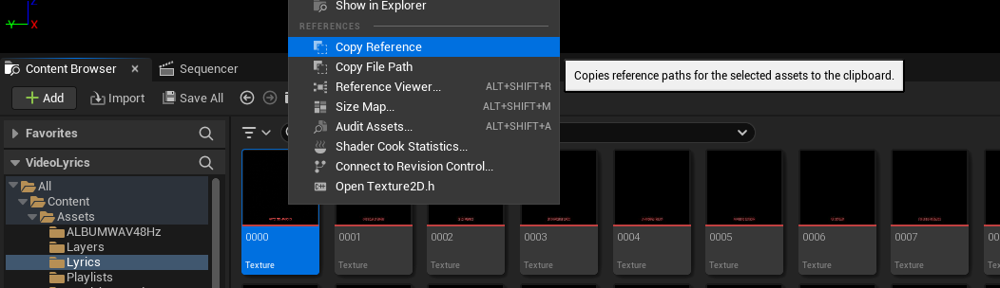
    You will get as a result: ``/Script/Engine.Texture2D'/Game/Assets/Lyrics/0000.0000'`` 
    **IMPORTANT**: It must be the first among ALL the assets, meaning it can only contain zeros.
    * FilenameDigits: The number of zeros contained in the FilenameWithAllZeros. In the previous example, it would be 4.
    * FirstFrameID: Used when we have the verses for an entire album. Here, you choose the frame number at which this song starts. If it's just one song, or if it's the first in a playlist, it should be 0.
    * TransitionDuration: Determines how long each verse takes to appear and fade out, as they undergo a fade-in and fade-out in alpha. If you want it to be immediate, simply put 0.
    * PlaylistTexture: An optional texture if you want to display a playlist of the song currently playing. It's recommended that it be a texture of the same size as the video to be rendered.
    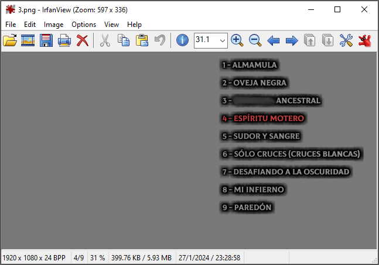
* SelectedSongs: An array of integers that indicates which songs from the previous list will be executed and in what order. For single-song videos, it should simply be an array with a single number.
* RemoveTonemapper: This option ensures that when you hit Play or Render Movie, you see the same result. By default, Unreal Engine adjusts the Tonemapper at runtime but not at render time. (This option should be here, but it's a way to centralize almost all project settings. This will help at rendering time.) 
**IMPORTANT**: For this option to work, there must be a PostProcessVolume in the level, even if it's with default values.
* PlaylistTimebarActorA and B: Two references to two instances of two actors. Why? Well, if in our video we want to show Timebars for each song, we'll create N number of PlaylistBars, where N is the number of songs in our "SelectedSongs" array. The creation of these objects will interpolate between the transforms of these two actors, so both their position, rotation, and scale will be obtained from the transform between these two objects.

In the gif, you can see where the timebars are actually located, and where the actors used for interpolation are (indicated with green arrows)  
It's important to emphasize some things about PlaylistTimebarActorA and B:
    1) If you don't specify any reference to these actors, there simply won't be any timebars. Using them is not mandatory.
    2) The timebars are large squares, so if you want them to look like bars, play with the scale of the actors.
    3) The material of the bars works its magic by coloring based on screen coordinates, so if you scale the actors and the bars change size, the material won't be affected.
    4) Don't forget to place them behind the BP_Lyrics, as this object also acts as a black curtain. Otherwise, they will appear in front.
    5) There's no practical way to place them in the desired location. I usually positioned them by eye, played the sequence, adjusted them if they were misplaced, and repeated until they looked right.

## LevelSequenceActor:
This Actor contains a reference to the LevelSequence we're interested in. To open it, we click this button ↓
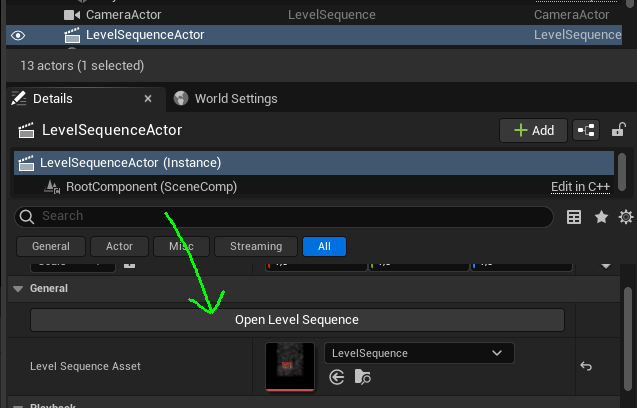 
And the Sequencer will open up
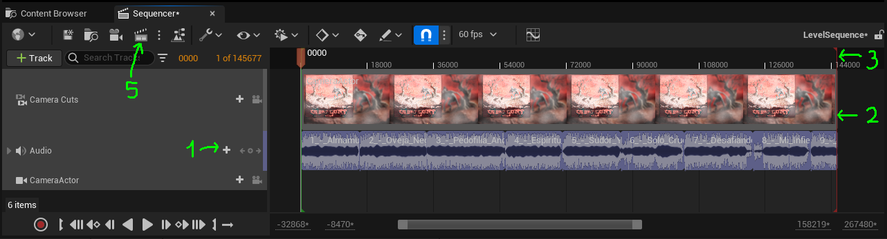 
Once the Sequencer is open, we need to add the audio or audios and adjust the duration, both of the CameraCuts and of the Sequencer itself.

1) In the audio track, we can add one or several songs, one after another, without leaving any gaps.
2) Once the audio for the video to be rendered is ready, we adjust the length of the CameraCuts to the last valid frame within the audio track (as if we were using floor()).
3) We adjust the end of the Sequencer (the red line) to the same frame as the CameraCuts.
4) Point 4 is to play and check that everything is fine:

    * The video looks as we want it to.
    * The subtitles open and close on time.
    * If there's a playlist, check that it appears and changes at the correct time.
    * If there are Timebars, ensure they are properly positioned.
    * If everything is OK, then...

5) Render the video:
Although we added the audio track to the sequencer, this is simply to ensure that the subtitles are properly synchronized. The reality is that Unreal Engine's encoder for audio channels leaves much to be desired, and we will have to add the audio to our video from outside of Unreal Engine. From here, we will render only the frames of our video.

Once we click the button, this window will open, and we will have to go to the Settings section and follow these steps:
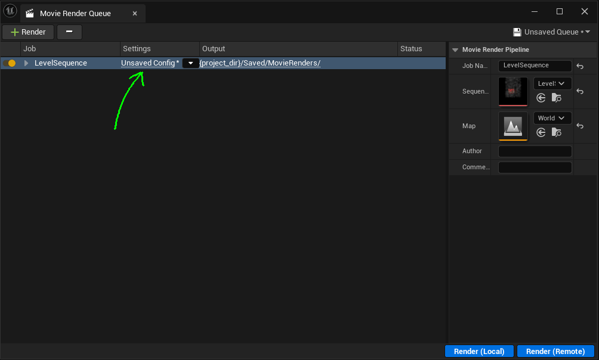 
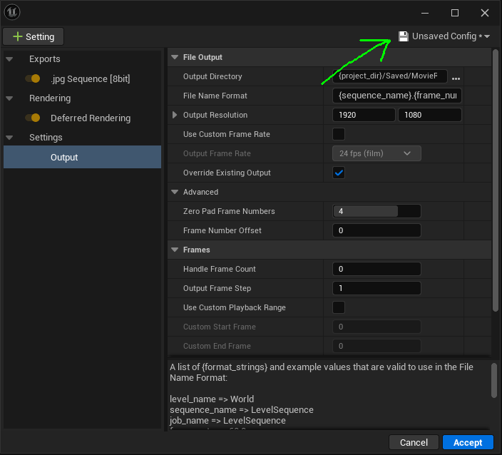 
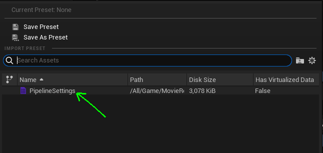 
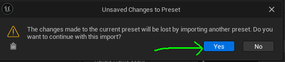 
Now, you need to go to the "Outputs" section, set the destination path for the frames, and accept the configuration.
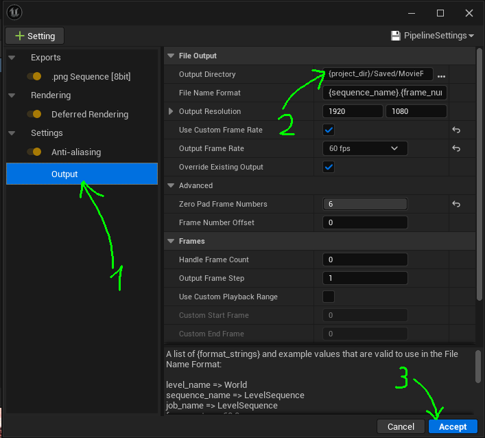 
Finally, click the Render button to start rendering all the frames..
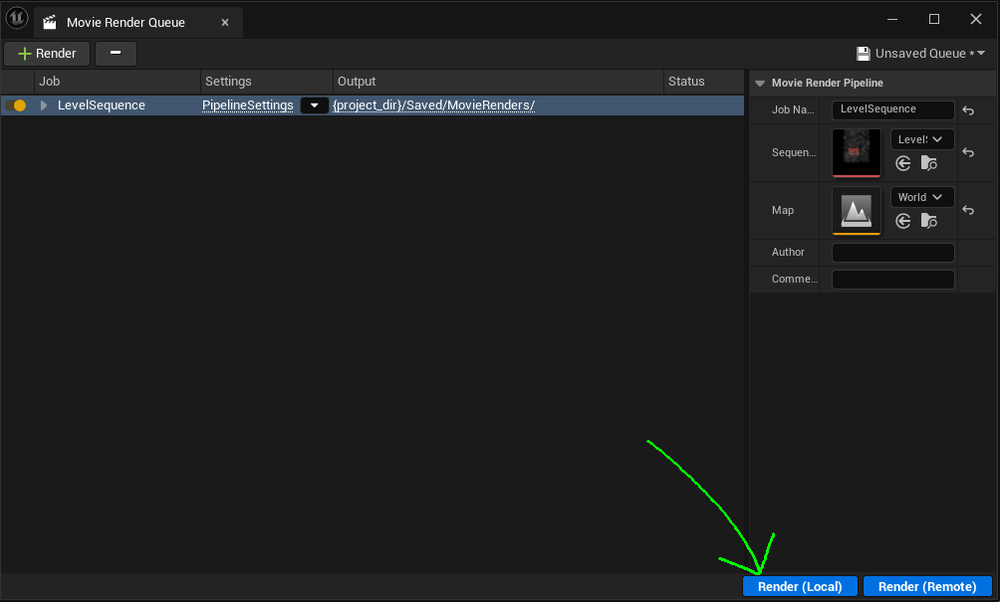 
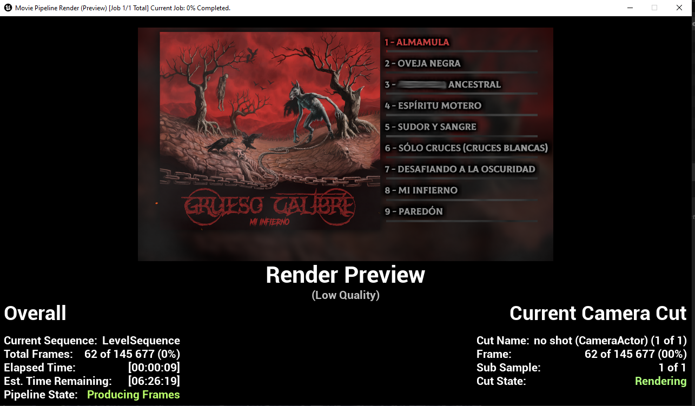 
Once it's done, all the frames will be in the folder you chose.
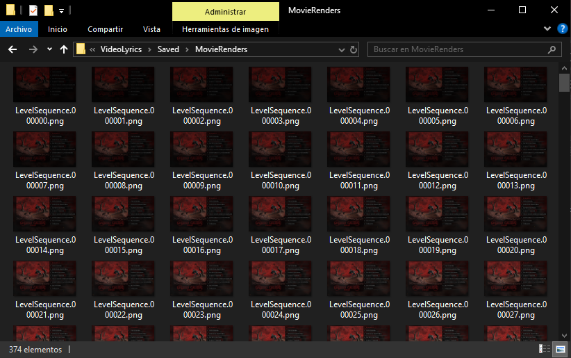 

## Render the video:
To render the video, we need to use [FFmpeg](https://ffmpeg.org/). You can learn how to install it from [this link](https://www.editframe.com/guides/how-to-install-and-start-using-ffmpeg-in-under-10-minutes), and it's essential to remember to add it to the PATH.

Also, we need to have the audio file for the video ready. If it's a playlist, try to convert all your audio files into one. For this purpose, you can use [Audacity](https://www.audacityteam.org/), which is a free tool.

Once FFmpeg is ready, and you have the folder filled with frames and the audio file in the same folder, you should open cmd, navigate to the project folder, and start the video rendering process with the following command: 
``ffmpeg -framerate 60 -i VideoLyrics.%06d.png -i song.wav -c:v libx265 -c:a flac -crf 0 -shortest video.mp4``

Parameters: 
-framerate 60    --->    60 fps 
-i VideoLyrics.%06d.png    --->    input of a sequence of frames with the name "VideoLyrics." + a number of 6 digits + ".png" 
-i song.wav    --->    input of a song called "song.wav" 
-c:v libx265    --->    the codec of the video. All people use libx264 but that changes the colors and libx265 not. 
-c:a flac    --->    the codec of the audio. FLAC (Free Lossles Audio Codec) without lossing quality 
-crf 0    --->    the minimum level of compression (without compression) 
-shortest    --->    that the length of the video is determined by the shortest duration between the song and the frames 
video.mp4    --->    the name of the output video 

**IMPORTANT**: This command will render your video with FULL QUALITY. So, the final file can weights several gigabytes.

If you have any questions, feel free to reach out to me on [my Discord](http://discordapp.com/users/671401036694421517) or send me an email at lorenzon.cesar@hotmail.com.
